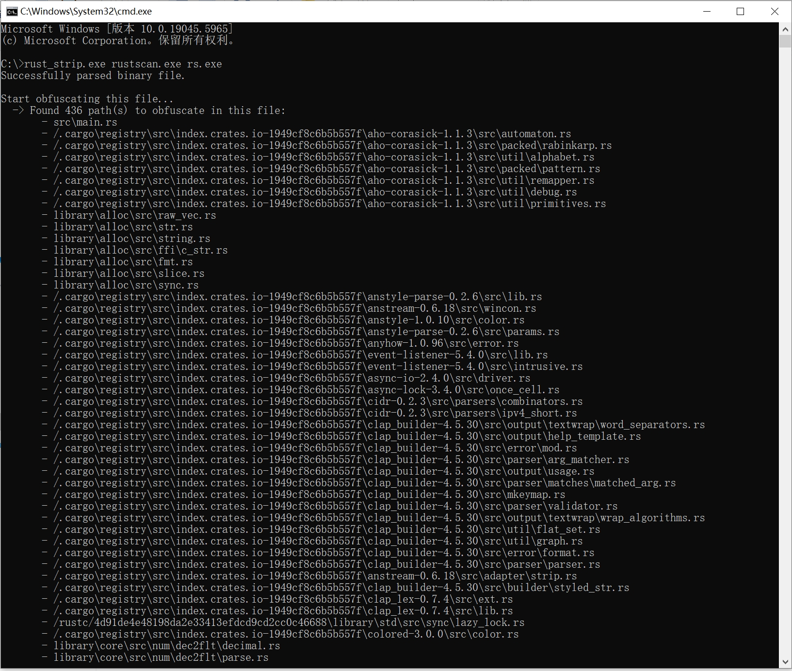

# rust-strip
用于去除rust编译时产生的源码、依赖路径信息，防止分析和溯源。

由于很多路径信息与cargo_home相关，所以此工具无法完全适配，故而提供一种折中的方法，在使用本工具前做以下工作：

1、首先获取CARGO_HOME路径，Linux中可通过以下命令获取：

``` 
echo $CARGO_HOME
```

windows中如果没有特别设置，默认是在%USERPROFILE%中，可通过以下命令获取：

```
echo %USERPROFILE%
```
2、在项目的.cargo/config文件中添加：

``` 	
rustflags = [
	"--remap-path-prefix", "/project=",
]
```

其中/project替换为你的CARGO_HOME路径（不含.cargo）

3、编译程序

****

Usage: rust-strip.exe <input_file> <output_file>

